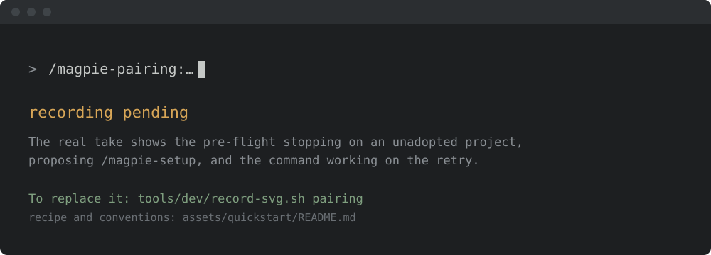

<!-- SPDX-License-Identifier: Apache-2.0
     https://www.apache.org/licenses/LICENSE-2.0 -->

<!-- START doctoc generated TOC please keep comment here to allow auto update -->
<!-- DON'T EDIT THIS SECTION, INSTEAD RE-RUN doctoc TO UPDATE -->
**Table of Contents**  *generated with [DocToc](https://github.com/thlorenz/doctoc)*

- [Agentic Pairing skill family](#agentic-pairing-skill-family)
  - [Install & first runs](#install--first-runs)
    - [The first run](#the-first-run)
    - [Try these first](#try-these-first)
  - [Skills](#skills)
    - [When to use which](#when-to-use-which)
  - [Relationship to `pr-management-code-review`](#relationship-to-pr-management-code-review)
  - [Adopter contract](#adopter-contract)
  - [Status](#status)
  - [Cross-references](#cross-references)

<!-- END doctoc generated TOC please keep comment here to allow auto update -->

<!-- SPDX-License-Identifier: Apache-2.0
     https://www.apache.org/licenses/LICENSE-2.0 -->

# Agentic Pairing skill family

> **Scope.** Works on any project, ASF or not — no
> Apache-Software-Foundation-specific assumptions baked in.

Developer-side pre-flight review skills that run in the maintainer's or
contributor's **own** dev loop — after local changes are ready but before
opening a PR. The family absorbs mechanical implementation-detail review
so the eventual human-to-human conversation between contributor and
maintainer stays on design, reasoning, and the trade-offs the project
cares about.

**Mentorship is intrinsic.** Agentic Pairing skills are not a replacement for
human code review; they are a pre-flight filter that separates
implementation-detail nits (formatting, convention violations, obvious
logical gaps) from the design-level conversation the project's
contributor-to-committer path is built on.

**No state changes.** Every skill in this family reads local git state
and returns a structured report. No PR is opened, no GitHub write
happens, no comment is posted, and the working tree is never mutated.

---

## Install & first runs

Install just this family — one plugin, 2 skills. Review your own change before anyone else has to.

```text
/plugin marketplace add apache/magpie
/plugin install magpie-pairing@apache-magpie
```

New to Magpie? The [quick start](../quick-start.md) walks the whole path in
one place — install, the first `/magpie-setup` run, and a recording of it
happening — plus the other agents and the secure-isolation setup to run next.

### The first run

The first time you call a skill in this family it checks whether the project is
set up, before it does anything else. On a project that has not been adopted it
stops right there and proposes `/magpie-setup`, rather than acting on
placeholders it cannot resolve:



That check is silent once the project is set up: it costs three file checks and
prints nothing.

### Try these first

*Real runs, recorded against a small sample change — your output will differ.
Both skills are read-only: nothing is sent, merged, or posted.*

**Self-review before you push.**

```text
/magpie-pairing:self-review
```


**Send it through an adversarial panel.**

```text
/magpie-pairing:multi-agent-review
```


## Skills

| Skill | Purpose | Status |
|---|---|---|
| [`pairing-self-review`](../../skills/pairing-self-review/SKILL.md) | Structured pre-flight self-review of local changes against a configurable base. Single-pass: correctness, security, and conventions in one report. | experimental |
| [`pairing-multi-agent-review`](../../skills/pairing-multi-agent-review/SKILL.md) | Fan the same diff through three independent axis-focused passes (correctness, security, conventions); merge findings with deduplication and severity ranking. Higher confidence than a single pass; each axis is isolated so findings cannot cross-contaminate. | experimental |

### When to use which

- **`pairing-self-review`** — the default quick check. Fast, single
  context, covers correctness + security + conventions.
- **`pairing-multi-agent-review`** — when you want adversarial
  independence between review axes. Each pass cannot see the others'
  findings, so a security issue buried in a conventions sweep cannot
  get lost. Use for changes touching security-sensitive paths or for
  the final check before a high-stakes PR.

Both skills are read-only / hand-back and produce the same structured
report format, so you can switch between them without changing your
workflow.

---

## Relationship to `pr-management-code-review`

`pairing-self-review` and `pairing-multi-agent-review` run **before** a
PR is open. Once a PR is open and you want a maintainer-side deep code
review of an incoming contribution, use
[`pr-management-code-review`](../../skills/pr-management-code-review/SKILL.md)
instead.

---

## Adopter contract

The Agentic Pairing skills have no project-specific config files. They resolve
two standard placeholders from the adopter's `<project-config>/`:

| Placeholder | Resolved from |
|---|---|
| `<upstream>` | `project.md → upstream_repo` (owner/name of the public source repo) |
| `<default-branch>` | `project.md → upstream_default_branch` (e.g. `main`) |

No additional config files are required. The skills do not write to the
project's tracker, label set, or any shared infrastructure.

---

## Status

**Experimental.** Both `pairing-self-review` and
`pairing-multi-agent-review` are shipped and validate under
`skill-and-tool-validate`. No adopter-pilot evaluation has run yet;
shape may change between framework versions.

To provide pilot feedback, copy
[`docs/pilot-report-template.md`](../pilot-report-template.md) into your
project notes, fill in each section, and optionally validate the filled-in
report with:

```bash
uv run --project tools/pilot-report-validator pilot-report-validate <your-report.md>
```

---

## Cross-references

- [`MISSION.md` § Agentic Pairing](../../MISSION.md#technical-scope) — mode
  rationale, sequencing constraints relative to Agentic Autonomous.
- [`docs/modes.md` § Pairing](../modes.md#pairing) — implementation
  status and mode-lifecycle stage.
- [`docs/modes.md` § Mode lifecycle](../modes.md#mode-lifecycle) — how
  a mode moves from `experimental` to `stable`.
- [`projects/_template/README.md`](../../projects/_template/README.md) —
  adopter scaffold index.
- [`docs/setup/agentic-overrides.md`](../setup/agentic-overrides.md) —
  the override mechanism every skill in this family supports.
