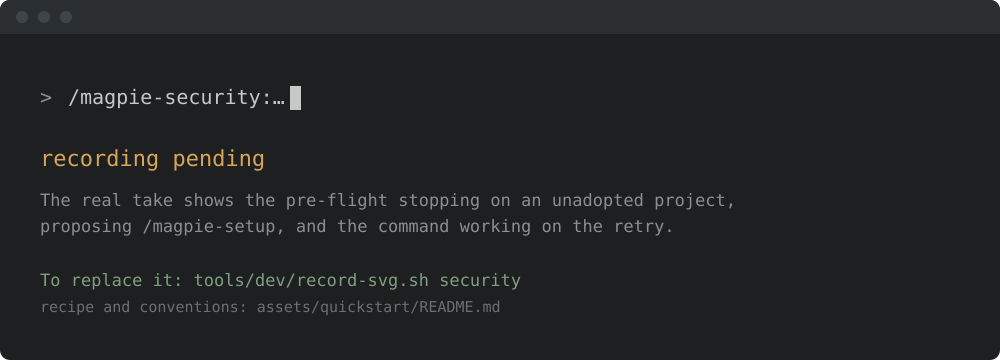

<!-- SPDX-License-Identifier: Apache-2.0
     https://www.apache.org/licenses/LICENSE-2.0 -->

<!-- START doctoc generated TOC please keep comment here to allow auto update -->
<!-- DON'T EDIT THIS SECTION, INSTEAD RE-RUN doctoc TO UPDATE -->
**Table of Contents**  *generated with [DocToc](https://github.com/thlorenz/doctoc)*

- [Security workflow skill family](#security-workflow-skill-family)
  - [Install & first runs](#install--first-runs)
    - [The first run](#the-first-run)
    - [Try these first](#try-these-first)
  - [Skills](#skills)
    - [Lifecycle skills](#lifecycle-skills)
    - [Security-model skills](#security-model-skills)
    - [Supporting tools](#supporting-tools)
  - [Deep documentation](#deep-documentation)
  - [Adopter contract](#adopter-contract)
  - [Cross-references](#cross-references)

<!-- END doctoc generated TOC please keep comment here to allow auto update -->

<!-- SPDX-License-Identifier: Apache-2.0
     https://www.apache.org/licenses/LICENSE-2.0 -->

# Security workflow skill family

> **Scope.** Works on any project, ASF or not. The ASF intake
> path (`security@`, Vulnogram CVE flow) is the default profile; non-ASF
> adopters swap it for GitHub Security Advisories / a MITRE CNA through the
> adapter/config layer.

End-to-end automation for an ASF project's security-issue handling
process — from inbound report on the project's `security@` mailing
list through to a published CVE record on `cve.org`. Eleven skills
that compose into the canonical 16-step lifecycle, three that produce,
verify, and maintain the project's own security model, plus one
read-only supporting skill for tracker-stats dashboards (fifteen skills
total).

Why a framework skill family? The 16-step process exists across
the foundation; every project's security team runs essentially
the same workflow with project-specific scope labels, mailing-list
addresses, milestone formats, and canned-response wording. Lifting
the workflow into a project-agnostic framework lets each adopter
plug their specifics into [`<project-config>/`](../../projects/_template/)
and reuse the skills verbatim.

## Install & first runs

Install just this family — one plugin, 15 skills. The security-report lifecycle, from intake through CVE publication.

```text
/plugin marketplace add apache/magpie
/plugin install magpie-security@apache-magpie
```

New to Magpie? The [quick start](../quick-start.md) walks the whole path in
one place — install, the first `/magpie-setup` run, and a recording of it
happening — plus the other agents and the secure-isolation setup to run next.

### The first run

The first time you call a skill in this family it checks whether the project is
set up, before it does anything else. On a project that has not been adopted it
stops right there and proposes `/magpie-setup`, rather than acting on
placeholders it cannot resolve:



That check is silent once the project is set up: it costs three file checks and
prints nothing.

### Try these first

*Illustrative shapes, not real transcripts — your output will differ. Nothing
below sends, merges, or posts anything without you confirming it.*

**Pull new reports out of the mailbox.**

```text
> /magpie-security:issue-import

  3 candidate reports on security@
  #4412 buffer overflow in parser   -> new tracking issue
  #4413 'is PHP 5 supported?'       -> not a report, skip
  Create 1 tracking issue? [y/N]
```

**Triage what came in.**

```text
> /magpie-security:issue-triage

  #4412  valid    high     -> reply drafted, CVE candidate
  #4415  invalid  n/a      -> canned response 'out of scope'
  Drafts are in Gmail; nothing sent.
```

**Check the security model still matches reality.**

```text
> /magpie-security:model-verify

  6 chapters checked against the published model
  GAP: no chapter covers dependency-only reports (4 this quarter)
```

## Skills

### Lifecycle skills

| Skill | Purpose |
|---|---|
| [`security-issue-import`](../../skills/security-issue-import/SKILL.md) | Import new reports from `<security-list>` into `<tracker>`. |
| [`security-issue-import-from-pr`](../../skills/security-issue-import-from-pr/SKILL.md) | Open a tracker for a security-relevant fix opened as a public PR. |
| [`security-issue-import-from-md`](../../skills/security-issue-import-from-md/SKILL.md) | Bulk-import findings from a markdown report. |
| [`security-issue-import-from-scan`](../../skills/security-issue-import-from-scan/SKILL.md) | Import findings from a security scanner output (Trivy, Grype, etc.) into `<tracker>`. |
| [`security-issue-import-via-forwarder`](../../skills/security-issue-import-via-forwarder/SKILL.md) | Import reports relayed through the ASF security forwarder when no direct reporter contact exists. |
| [`security-issue-triage`](../../skills/security-issue-triage/SKILL.md) | Propose an initial-triage disposition (VALID / DEFENSE-IN-DEPTH / INFO-ONLY / INVALID / PROBABLE-DUP / FIX-ALREADY-PUBLIC) for each tracker still in `Needs triage`; opens a discussion comment, never flips the label. |
| [`security-issue-sync`](../../skills/security-issue-sync/SKILL.md) | Reconcile a tracker against its mail thread, fix PR, release train, and archives. |
| [`security-cve-allocate`](../../skills/security-cve-allocate/SKILL.md) | Allocate a CVE for a tracker (Vulnogram URL + paste-ready JSON). |
| [`security-issue-fix`](../../skills/security-issue-fix/SKILL.md) | Implement the fix as a public PR in `<upstream>`. |
| [`security-issue-deduplicate`](../../skills/security-issue-deduplicate/SKILL.md) | Merge two trackers describing the same root-cause vulnerability. |
| [`security-issue-invalidate`](../../skills/security-issue-invalidate/SKILL.md) | Close a tracker as invalid with a polite-but-firm reporter reply. |

### Security-model skills

The lifecycle skills above route **one report**. These three maintain the
document they route it against — the project's security model — so that
routing has something to cite. See
[**`security-model-preparation.md`**](security-model-preparation.md) for
the lifecycle and the rationale.

| Skill | Purpose |
|---|---|
| [`security-model-prepare`](../../skills/security-model-prepare/SKILL.md) | Produce a first model for a project that has none, in draft-first mode, and land it with its discoverability chain as one PR per repository. |
| [`security-model-verify`](../../skills/security-model-verify/SKILL.md) | Pre-flight an existing model: can an agent mechanically reach it, and does it cover the minimum bar a triager depends on. Discoverability is the only hard gate. |
| [`security-model-update`](../../skills/security-model-update/SKILL.md) | Read the decision history back into the model — new known-non-finding entries and a model-gap list, regression-checked against past valid reports. |

The rubric these skills measure against is maintained externally by
Alpha-Omega (<https://github.com/alpha-omega-security/threat-model>) and
referenced by URL; Magpie keeps no local copy.

### Supporting tools

| Skill | Purpose |
|---|---|
| [`security-tracker-stats-dashboard`](../../skills/security-tracker-stats-dashboard/SKILL.md) | Generate a self-contained HTML dashboard of `<tracker>` repo statistics (lifecycle bands, opened-vs-untriaged backlog, mean time to triage / first response / fix). Read-only — never modifies tracker state. |

## Deep documentation

- [**`poc-handling-policy.md`**](poc-handling-policy.md) — what an
  agent may do with reporter-supplied proof-of-concept code: static
  review by default, isolated container only on explicit approval,
  never on the host.
- [**`security-model-preparation.md`**](security-model-preparation.md) —
  the produce / verify / update lifecycle for the project's own
  security model: the external Alpha-Omega rubric, the
  `AGENTS.md` → `SECURITY.md` discoverability chain and why it is the
  only hard gate, why substantive findings go to the private list
  rather than a public issue, the provenance tags that make a
  draft-first model safe, and the fence around the known-non-findings
  section.
- [**`process.md`**](process.md) — the 16-step lifecycle with
  Mermaid diagram + per-step description; the label lifecycle
  state diagram + label reference table. The authoritative
  process reference.
- [**`roles.md`**](roles.md) — who owns which steps (issue
  triager / remediation developer / release manager), the shared
  conventions every role observes (keeping the reporter informed,
  recording status transitions, confidentiality), and the
  role-by-role workflow walkthroughs.
- [**`how-to-fix-a-security-issue.md`**](how-to-fix-a-security-issue.md) —
  hands-on guide for a remediation developer picking up a
  CVE-allocated tracker and shipping the fix.
- [**`new-members-onboarding.md`**](new-members-onboarding.md) —
  onboarding for a new security-team member: tracker access, mail
  list subscription, expected reading, first triage shadow.
- [**`threat-model.md`**](threat-model.md) — release-blocking
  threat model for the security skill family: trust boundaries,
  adversary personas, STRIDE matrix per skill, mitigation cross-
  reference, residual risk, and the re-audit cadence.
- [**`forwarder-routing-policy.md`**](forwarder-routing-policy.md) —
  when a tracker has no direct reporter contact (ASF-relay,
  read-only GHSA, anonymous tip), the skills route reporter-facing
  communication through the forwarder. The policy defines when
  that mode applies, the milestone list (events that **do** get
  relayed), and the negative list (events that don't — including
  credit-confirmation questions and regular workflow status).

## Adopter contract

The skills resolve project-specific content from the security-
workflow files in
[`<project-config>/`](../../projects/_template/) — see the
adopter scaffold's
[`README.md`](../../projects/_template/README.md) for the
file-by-file index. Required at minimum:

- `project.md` — identity, repos, mailing lists, tools
- `canned-responses.md` — reporter-facing reply templates
- `scope-labels.md` — scope label → CVE product mapping
- `release-trains.md` — release-manager attribution
- `title-normalization.md` — CVE-title regex cascade

Optional but commonly needed:
`milestones.md`, `fix-workflow.md`, `security-model.md`
(required by the security-model skills),
`naming-conventions.md`.

## Cross-references

- [Top-level README — Install](../../README.md#install) — 3-step bootstrap.
- [`docs/prerequisites.md`](../prerequisites.md) — what a security
  triager / remediation developer / release manager needs
  installed before invoking any skill.
