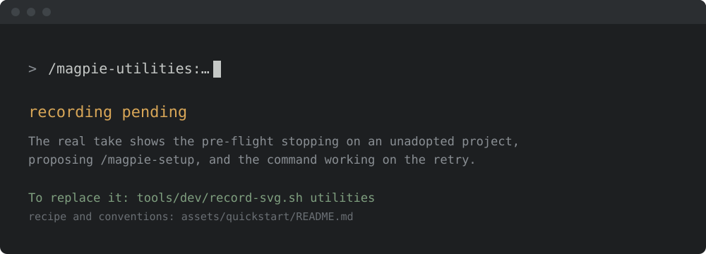

<!-- SPDX-License-Identifier: Apache-2.0
     https://www.apache.org/licenses/LICENSE-2.0 -->

<!-- START doctoc generated TOC please keep comment here to allow auto update -->
<!-- DON'T EDIT THIS SECTION, INSTEAD RE-RUN doctoc TO UPDATE -->
**Table of Contents**  *generated with [DocToc](https://github.com/thlorenz/doctoc)*

- [Utilities skill family](#utilities-skill-family)
  - [Install & first runs](#install--first-runs)
    - [The first run](#the-first-run)
    - [Try these first](#try-these-first)
  - [Skills](#skills)
  - [When to adopt this family](#when-to-adopt-this-family)
  - [Adopter contract](#adopter-contract)
  - [Status](#status)
  - [Cross-references](#cross-references)

<!-- END doctoc generated TOC please keep comment here to allow auto update -->

<!-- SPDX-License-Identifier: Apache-2.0
     https://www.apache.org/licenses/LICENSE-2.0 -->

# Utilities skill family

> **Scope.** Works on any project, ASF or not — no
> Apache-Software-Foundation-specific assumptions baked in.

Framework meta-skills — the tools you use to **build and maintain skills
themselves**, rather than to run a maintainership mode on your project. They
sit outside the MISSION mode taxonomy (Agentic Triage, Agentic Mentoring,
Agentic Drafting, Agentic Pairing, Agentic Autonomous): nothing here acts on
your issues, PRs, or contributor threads.
They are for skill authors and framework contributors.

---

## Install & first runs

Install just this family — one plugin, 5 skills. Framework meta-skills: author, restructure, and index your own skills.

```text
/plugin marketplace add apache/magpie
/plugin install magpie-utilities@apache-magpie
```

New to Magpie? The [quick start](../quick-start.md) walks the whole path in
one place — install, the first `/magpie-setup` run, and a recording of it
happening — plus the other agents and the secure-isolation setup to run next.

### The first run

The first time you call a skill in this family it checks whether the project is
set up, before it does anything else. On a project that has not been adopted it
stops right there and proposes `/magpie-setup`, rather than acting on
placeholders it cannot resolve:



That check is silent once the project is set up: it costs three file checks and
prints nothing.

### Try these first

*Illustrative shapes, not real transcripts — your output will differ. Nothing
below sends, merges, or posts anything without you confirming it.*

**List everything installed.**

```text
> /magpie-utilities:list-skills

  magpie-setup            9 skills
  magpie-pr-management    8 skills
  17 skills, ~5.0k always-on tokens
```

**Author a new skill.**

```text
> /magpie-utilities:write-skill

  What should the skill do? > sweep our Jira for stale triage
  Scaffolded skills/jira-stale-sweep/SKILL.md (frontmatter, 6 steps)
```

**Report a framework bug upstream.**

```text
> /magpie-utilities:report-framework-issue

  Searched apache/magpie: no existing issue matches
  Drafted issue 'setup-status misreports drift on a fork'
  Open it? [y/N]
```

## Skills

| Skill | Purpose | Status |
|---|---|---|
| [`write-skill`](../../skills/write-skill/SKILL.md) | Author a new framework skill or update an existing one: frontmatter, placeholder convention, injection defenses, Privacy-LLM gate-check, and validator sign-off. | stable |
| [`optimize-skill`](../../skills/optimize-skill/SKILL.md) | Optimize an existing skill by applying restructuring patterns — split an oversized `SKILL.md` into linked sibling docs, trim frontmatter, and improve eval alignment. | stable |
| [`list-skills`](../../skills/list-skills/SKILL.md) | Print a live index of every skill in this repository, grouped by family, with each skill's name and first-sentence description. | stable |
| [`skill-reconciler`](../../skills/skill-reconciler/SKILL.md) | Reconcile a skill's declared state (frontmatter, sibling docs, symlinks) against the framework's conventions and surface discrepancies with proposed fixes. | stable |

---

## When to adopt this family

Adopt `utilities` if you intend to **write or maintain your own skills** —
whether contributing them back to Magpie or keeping them in your own project.
If you are only adopting existing skills to run on your project, you do not
need this family; the [`setup`](../setup/README.md) family is your starting
point instead.

---

## Adopter contract

The utilities skills have no project-specific config files and make no state
changes to your project's tracker, label set, or shared infrastructure.
`list-skills` and `optimize-skill` are read-only; `write-skill` only creates or
edits skill files under your control, which you review before committing.

---

## Status

**Stable.** All four skills are shipped and validate under
`skill-and-tool-validate`. They are framework-authoring tools, so they evolve
with the framework's own conventions rather than with adopter pilots.

---

## Cross-references

- [`docs/modes.md` § Meta](../modes.md#meta) — why
  these skills sit outside the maintainership-mode taxonomy.
- [`docs/spec-driven-development.md`](../spec-driven-development.md) — the
  authoring loop `write-skill` and `optimize-skill` support.
